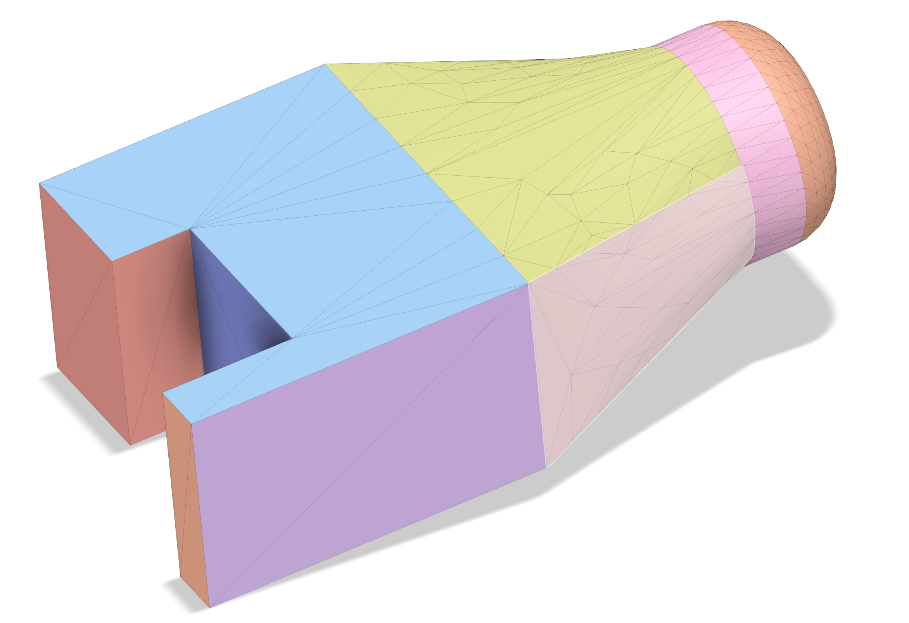

# stl-meshing
Determine which points in a densely sampled mesh grid lay inside the volume defined by an STL file.

## Process
The purpose of this library is to check if the given points are inside or outside the volume defined by the STL object.
This is technically called the "Point-in-Polygon" problem (https://en.wikipedia.org/wiki/Point_in_polygon).

We use a ray casting algorithm to check if the provided points are inside the triangulated surface or not.
This function is JIT compiled using numba.
This works by computing how many times a ray intersects the triangulated surface.
If it intersects an odd number of times, the point is inside the surface.
Otherwise, the point is outside.
The intersection is computed using the Moller-Trumbore intersection algorithm.

## Example
In this example we start with an STL file which looks like this:


An example of how this library can be used is shown below. This code snippet does the following:
1. Create an STL object
2. Prints some summary info (surface area, volume, bounding box)
3. Generate a dense mesh of points in 3D space
4. Test whether each each point is inside the volume or not

```python
import os.path
import numpy as np
import matplotlib.pyplot as plt

from stlmeshing.stl import STL
from stlmeshing.points_inside import points_inside
from stlmeshing.mesh3d_plotter import plot_interactive_3d

test_stl = STL(os.path.join(os.path.dirname(__file__), "stl_mesh_test.stl"))

print(f"stl_mesh_test surface area: {test_stl.surface_area():.2f}")
print(f"stl_mesh_test volume: {test_stl.volume():.4e}")

((x_min, x_max), (y_min, y_max), (z_min, z_max)) = test_stl.bounding_box()
print("Bounding box:")
print(f"\tx: {x_min} - {x_max}")
print(f"\ty: {y_min} - {y_max}")
print(f"\tz: {z_min} - {z_max}")

# Create a test mesh based on the bounding box
point_spacing = 1.0
border_size = 2
npoints_x = int(np.rint(((x_max - x_min) / point_spacing) + (2 * border_size)).item()) + 1
npoints_y = int(np.rint(((y_max - y_min) / point_spacing) + (2 * border_size)).item()) + 1
npoints_z = int(np.rint(((z_max - z_min) / point_spacing) + (2 * border_size)).item()) + 1

x_points = (x_min - (border_size * point_spacing)) + np.arange(npoints_x) * point_spacing
y_points = (y_min - (border_size * point_spacing)) + np.arange(npoints_y) * point_spacing
z_points = (z_min - (border_size * point_spacing)) + np.arange(npoints_z) * point_spacing
mesh_x, mesh_y, mesh_z = np.meshgrid(x_points, y_points, z_points, indexing="ij")

print("Computing which points are inside the mesh...")
inside = points_inside(test_stl, mesh_x, mesh_y, mesh_z)
print("... Done computing which points are inside the mesh")

plot_interactive_3d(inside)
```
